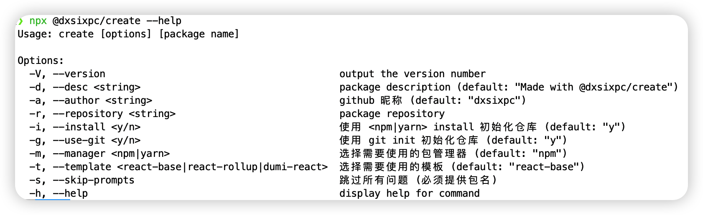

---
nav:
  title: 开始
  order: 0
title: 快速开始
---

# @dxsixpc/create

[](https://npmjs.org/package/@dxsixpc/create)
[](https://npmjs.org/package/@dxsixpc/create)
[](https://github.com/umijs/dumi)

# 简介

## 前端项目脚手架

> 快速生成 react 项目

## 使用

#### 全局安装

```shell
npm install -g @dxsixpc/create
```

全局安装完成后，可直接使用 create 命令

```shell
create
```


#### 通过 npx 直接使用

```shell
npx @dxsixpc/create
```


#### 命令参数

```shell
npx @dxsixpc/create --help
```



## License

MIT © [dxsixpc](https://github.com/dxsixpc)
